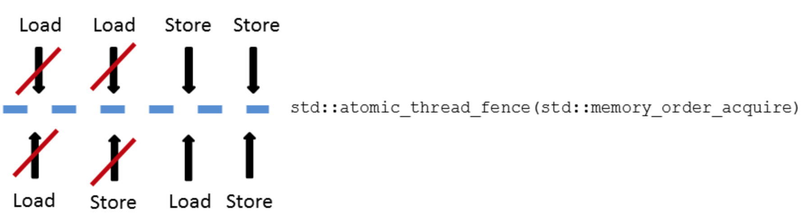
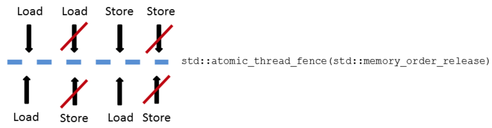

# Fences as Memory Barriers

Typically, three kinds of fences are used: full fence, acquire fence and release fence. As a reminder, acquire is a load, and release is a store operation. What happens if I place one of the three memory barriers between the four combinations of load and store operations?

* **Full fence**: A full fence `std::atomic_thread_fence()` between two arbitrary operations prevents the reordering of these operations, but guarantees that it won’t hold for store-then-load operations – they can be reordered.

* **Acquire fence**: An acquire fence `std::atomic_thread_fence(std::memory_order_acquire)` prevents a read operation before an acquire fence from being reordered with a read or write operation after the acquire fence.

* **Release fence**: A release fence `std::atomic_thread_fence(std::memory_order_release)` prevents a read or write operation before a release fence from being reordered with a write operation after a release fence.

## Full fence

## Acquire fence

## Release fence

